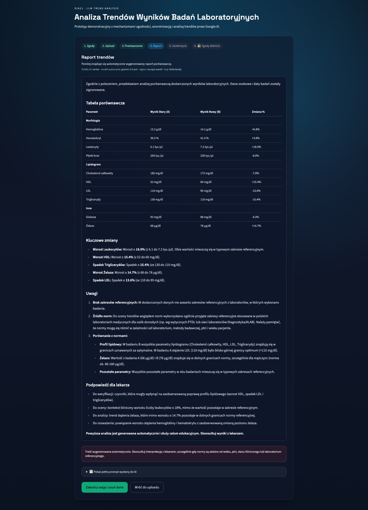
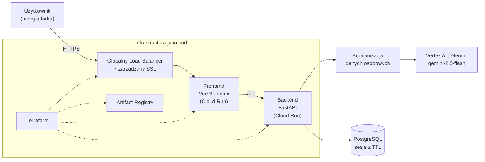

# Diag1

> Aplikacja webowa do porównywania wyników badań laboratoryjnych z użyciem AI — z anonimizacją danych osobowych po stronie serwera.

[](https://diag1.imaster.pl)
[](LICENSE)
[](#stack-technologiczny)
[](#stack-technologiczny)
[](#stack-technologiczny)
[](#stack-technologiczny)
[](#wdrożenie-do-gcp)
[](#wdrożenie-do-gcp)

**▶ Demo na żywo: [diag1.imaster.pl](https://diag1.imaster.pl)**



<sub>Ekran raportu: zanonimizowane porównanie dwóch serii wyników z analizą wygenerowaną przez model AI.</sub>

---

## O projekcie

Diag1 powstał jako praca końcowa (IMiOZ) i pokazuje, jak **bezpiecznie wykorzystać model językowy do analizy danych medycznych**. Użytkownik wprowadza dwie serie wyników badań laboratoryjnych, a aplikacja:

1. parsuje dane (w tym z plików PDF),
2. **anonimizuje dane osobowe** przed wysłaniem czegokolwiek do modelu AI,
3. zleca modelowi (Vertex AI lub Gemini) porównanie serii i generuje czytelną analizę,
4. przechowuje wynik w sesji o ograniczonym czasie życia (dane nie są składowane na stałe).

Kluczowy element to **privacy-by-design**: model nigdy nie widzi surowych danych identyfikujących pacjenta, a poziom anonimizacji jest konfigurowalny.

## Funkcje

- 🔬 Porównanie dwóch serii wyników badań laboratoryjnych z analizą AI
- 🛡️ Automatyczna anonimizacja danych osobowych z konfigurowalnymi poziomami
- 📄 Obsługa wejścia tekstowego oraz parsowanie wyników z PDF
- ⏱️ Sesje analityczne z czasowym TTL — brak trwałego składowania danych wrażliwych
- 🤖 Dwa tryby dostawcy AI: **Vertex AI** lub **Gemini Developer API** (przełączalne zmienną środowiskową)
- 🔐 Opcjonalna bramka hasłowa front-endu + prosty panel administracyjny
- ☁️ Pełna infrastruktura jako kod (Terraform): Cloud Run, Artifact Registry, globalny Load Balancer, zarządzany certyfikat SSL
- 🐳 Cały stack lokalnie jednym poleceniem (Docker Compose + Makefile)

## Architektura



Model wdrożenia jest celowo prosty: obrazy budowane lokalnie → Artifact Registry → Terraform uruchamiany lokalnie. Repo nie zakłada GitHub Actions ani Cloud Build.

## Stack technologiczny

| Warstwa | Technologie |
|---|---|
| Backend | Python 3.12, FastAPI, SQLAlchemy, Alembic |
| Frontend | Vue 3, Vite 5, Tailwind CSS, nginx |
| AI | Vertex AI / Google Gemini (`gemini-2.5-flash`) |
| Baza danych | PostgreSQL |
| Infrastruktura | Docker, Cloud Run, Terraform, Artifact Registry, globalny LB + SSL |

## Szybki start (lokalnie)

Wymagania: Docker (Desktop lub Engine), `make`, opcjonalnie `gcloud` jeśli używasz Vertex AI lokalnie.

```bash
git clone https://github.com/Batman1941/diag1.git
cd diag1
cp .env.example .env      # uzupełnij wartości
make up
make migrate
```

Adresy lokalne:

- frontend: `http://localhost:9080`
- backend health: `http://localhost:9000/api/healthz`
- PostgreSQL: `localhost:9543`

Podstawowe komendy: `make up` · `make down` · `make logs` · `make build` · `make migrate`

### Wybór dostawcy AI

- **Gemini Developer API:** `AI_PROVIDER=gemini` + `GEMINI_API_KEY`
- **Vertex AI:** `AI_PROVIDER=vertex` + `VERTEX_PROJECT_ID` + `VERTEX_LOCATION`, oraz `gcloud auth application-default login` (lub lokalny plik service account JSON wskazany przez `GOOGLE_APPLICATION_CREDENTIALS`)

## Wdrożenie do GCP

Wdrożenie odbywa się w pełni z lokalnej maszyny:

```bash
# 1. Bootstrap projektu GCP (włącza API, tworzy bucket na stan Terraform)
./scripts/gcp_bootstrap.sh <PROJECT_ID> <BILLING_ACCOUNT_ID> [REGION]

# 2. Zbuduj i wypchnij obrazy (Cloud Run wymaga linux/amd64)
export PROJECT_ID=<your-gcp-project-id> REGION=europe-west4
gcloud auth configure-docker "$REGION-docker.pkg.dev"
docker build --platform linux/amd64 -t "$REGION-docker.pkg.dev/$PROJECT_ID/diag1/backend:release-001" ./backend
docker build --platform linux/amd64 --build-arg VITE_API_URL=https://twoja-domena \
  -t "$REGION-docker.pkg.dev/$PROJECT_ID/diag1/frontend:release-001" ./frontend
docker push "$REGION-docker.pkg.dev/$PROJECT_ID/diag1/backend:release-001"
docker push "$REGION-docker.pkg.dev/$PROJECT_ID/diag1/frontend:release-001"

# 3. Terraform (środowisko stage)
cp terraform/stage/terraform.tfvars.example terraform/stage/terraform.tfvars  # uzupełnij
./scripts/terraform_gcp.sh --env stage init
./scripts/terraform_gcp.sh --env stage apply -var-file=terraform.tfvars
```

Terraform wystawia: Artifact Registry, Cloud Run (backend + frontend), globalny Load Balancer i zarządzany certyfikat SSL. Po `apply` pobierz adres LB (`terraform output -raw lb_ip`) i dodaj rekord `A` dla domeny. Pomocnicze: `scripts/show_dns_records.sh`, `scripts/smoke_check_cloudrun.sh`.

## Konfiguracja

Najważniejsze zmienne środowiskowe (pełna lista w [.env.example](.env.example)):

| Zmienna | Opis |
|---|---|
| `AI_PROVIDER` | `vertex` / `gemini` / `auto` |
| `GEMINI_API_KEY` | klucz dla Gemini Developer API |
| `VERTEX_PROJECT_ID`, `VERTEX_LOCATION` | konfiguracja Vertex AI |
| `DATABASE_URL` | DSN do PostgreSQL |
| `ADMIN_PASSWORD` | **ustaw własną wartość** w każdym wdrożeniu |
| `FRONTEND_ACCESS_PASSWORD`, `FRONTEND_ACCESS_COOKIE_SECRET` | opcjonalna bramka hasłowa front-endu |
| `SESSION_TTL_HOURS` | czas życia sesji analitycznej |

## Bezpieczeństwo

- Nie commituj plików z kluczami, hasłami ani lokalnych eksportów danych — `.env` i `terraform/**/*.tfvars` są poza Gitem.
- W każdym wdrożeniu ustaw własne `ADMIN_PASSWORD`, a przy włączonej bramce hasłowej również `FRONTEND_ACCESS_COOKIE_SECRET`.
- Dane medyczne są anonimizowane po stronie serwera **przed** wysłaniem do modelu AI.
- Repozytorium ma włączone GitHub secret scanning + push protection.

## Licencja

Projekt na licencji [MIT](LICENSE).

---

<sub>Projekt akademicki (praca końcowa, IMiOZ). Repozytorium zawiera wyłącznie kod aplikacji i infrastrukturę — bez dokumentów projektowych, danych badań i wyników testów.</sub>
